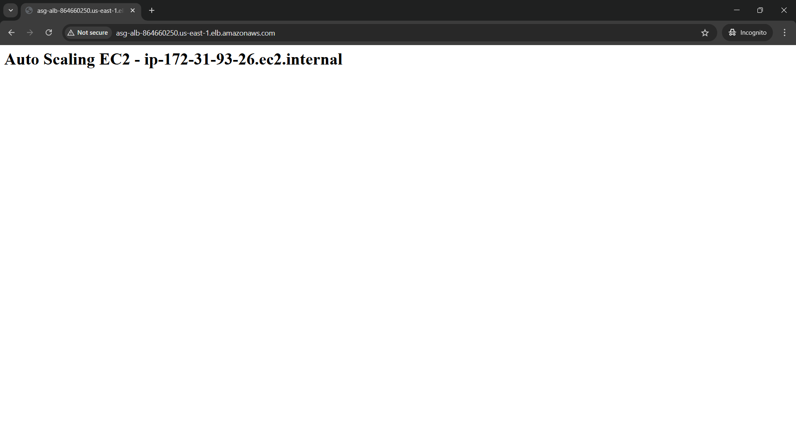

# 🚀 AWS EC2 Auto Scaling with Application Load Balancer

This project demonstrates a **highly available, fault-tolerant web application** using AWS core services.

---

## 🧩 Architecture Overview

---

## 🔧 Services Used

- Amazon EC2 (Amazon Linux)
- Application Load Balancer (ALB)
- Auto Scaling Group (ASG)
- Target Groups & Health Checks
- Security Groups
- Nginx Web Server

---

## ⚙️ Project Flow

1. User sends request from browser
2. Request reaches **Application Load Balancer**
3. ALB forwards traffic to **Target Group**
4. Target Group routes traffic to **healthy EC2 instances**
5. Auto Scaling automatically:
   - Adds instances during high traffic
   - Replaces failed instances (self-healing)

---

## 🖥️ Output Screenshots

### Load Balanced Output

---

## 🔐 Security

- HTTP (Port 80) enabled for web traffic
- Security Groups control inbound access
- SSH used only for initial setup (not public access)

---

## 📌 Notes

> This project was implemented using **AWS Free Tier**.  
> EC2 instances were **terminated after successful testing** to avoid unnecessary costs.  
> Screenshots are shared for verification.

---

## 👤 Author

**Nithiya Bharathi**  
Hands-on AWS Practice | EC2 | Load Balancing | Auto Scaling
